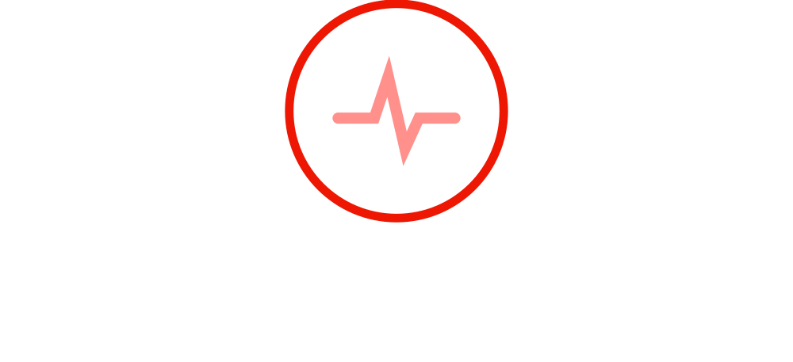

# Prognosis WebApp

             Prognosis is the web application that allows users to predict whether the user has been infected with a menacing disease or not.
These diseases can be very dangerous to health if they are not treated properly.
The main objective of prognosis is to help people predict the disease in case of absence of medical professionals, strikes or any related uncertainties.

 

The Machine learning algorithm deployed along with the website will diagnose the disease as accurately as possible. The accuracy of the model depends on the amount of the dataset provided. Current accuracy of the model is 89%.

### Disease Description

 The mentioned disease will be diagnosed by the predictive model in the project

- Heart Failure Prediction
- Breast Cancer Prediction
- Diabetes Prediction
- Pneumonia Prediction

### Why Prognosis

The main objective of prognosis is to aid individuals, medical professionals or any learners to help diagnose disease based on the data. For example , if you want to know if you have suffered from heart disease, you only need to input some data such as BMI, Age, Cholesterol, RestingECG etc. The Machine Learning model integrated with websites helps predict whether you have got a certain disease or not.

